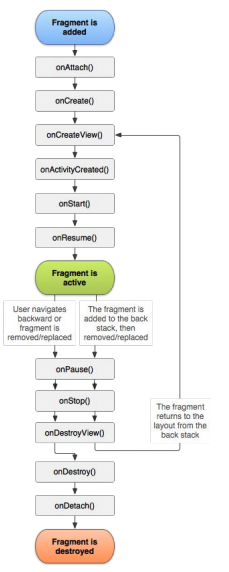
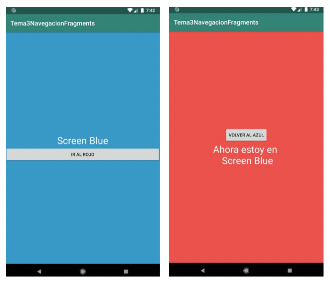
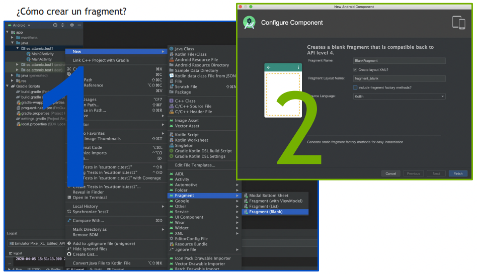
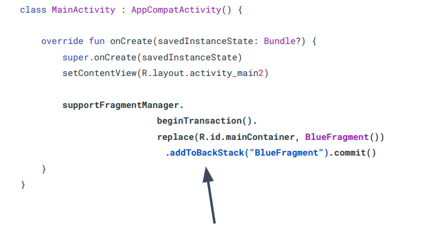

# Navegación II

## Fragments

Los fragment forman parte del activity. Se complementan. El Activity es como el canal para mostrar
cosas y los Fragment ... Lo normal es tener un Activity que va a tener muchos Fragments

### Qué son y sus ciclos de vida

Un fragmento es un componente de Android que contiene parte del comportamiento y / o la interfaz de
usuario de una actividad. Los fragmentos están vinculados a una sola actividad. En muchos sentidos,
tienen una funcionalidad similar a la de las actividades.

*Imagina por un momento que eres una actividad. Tienes mucho que hacer, por lo que puedes emplear a
unos pocos minions para que te lleven la ropa y paguen impuestos a cambio de alojamiento y comida.
Eso es algo así como la relación entre actividades y fragmentos.*

No es un requisito utilizar fragments, porque tu mismo puedes lavar tu ropa y pagar tus impuestos,
pero si los usas bien pueden proporcionar:

* **Modularidad**: dividir código de actividad complejo entre fragmentos para una mejor organización
  y mantenimiento.

* **Reusabilidad**: colocar el comportamiento o las partes de la IU en fragmentos que pueden
  compartirse en múltiples actividades.

* **Adaptabilidad**: representa secciones de una interfaz de usuario como diferentes fragmentos y
  utiliza diferentes diseños según la orientación y el tamaño de la pantalla.

Tutorial para aprenderlo todo sobre los
fragments: https://www.raywenderlich.com/169885/android-fragments-tutorial-introduction-2



**Vamos a crear dos Fragment**

Nos tiene que quedar así:

```kotlin
class BlueFragment : Fragment() {
    override fun onCreateView(
        inflater: LayoutInflater, container: ViewGroup?,
        savedInstanceState: Bundle?
    ): View? {
        // Inflate the layout for this fragment
        return inflater.inflate(R.layout.fragment_blue, container, false)
    }
}
```



**¿Cómo crear un fragment?**



### Navegación con Fragments

1. Necesitamos crear un FragmentContainerView en una Activity como "contenedor" donde meter nuestro
   Fragment

```xml
<?xml version="1.0" encoding="utf-8"?>
<LinearLayout xmlns:android="http://schemas.android.com/apk/res/android"
    xmlns:app="http://schemas.android.com/apk/res-auto"
    xmlns:tools="http://schemas.android.com/tools" android:layout_width="match_parent"
    android:layout_height="match_parent" android:orientation="vertical"
    tools:context=".Main2Activity">

    <androidx.fragment.app.FragmentContainerView android:id="@+id/mainContainer"
        android:layout_width="match_parent" android:layout_height="match_parent" />

</LinearLayout>
```

Este código lo pegaríamos, en nuestro ejemplo, en el ActivityMain

2. En el Activity, le decimos que en el **FragmentContainerView** tiene que estar nuestro Fragment

```kotlin
class MainActivity : AppCompatActivity() {
    override fun onCreate(savedInstanceState: Bundle?) {
        super.onCreate(savedInstanceState)
        setContentView(R.layout.activity_main2)

        supportFragmentManager.beginTransaction().replace(R.id.mainContainer, BlueFragment())
            .commit()
    }
}
```

### Volver atrás

Si necesitamos volver atrás entre fragments, antes de lanzarlo hay que añadirlo a una “pila” que se
llama “backStack”. De esa manera se guardará que en algún momento querremos volver atrás.

Estos serian los pasos:

1. Lanzar el primer fragment desde la activity, a este no queremos volver atrás, si no que será el
   principal

```kotlin
class MainActivity : AppCompatActivity() {

    override fun onCreate(savedInstanceState: Bundle?) {

        super.onCreate(savedInstanceState)
        setContentView(R.layout.activity_main2)

        supportFragmentManager
            .beginTransaction()
            .replace(R.id.mainContainer, BlueFragment())
            .addToBackStack("BlueFragment").commit() // <======

        // Ahora al ejecutar estariamos viendo un Activity que contiene un Fragment dentro
    }
}
```



2. Desde el fragment “BlueFragment” llamaremos al “RedFragment” al pulsar un botón y le diremos que
   nos guarde el fragment en la pila

```kotlin
class BlueFragment : Fragment() {
    override fun onCreateView(
        inflater: LayoutInflater,
        container: ViewGroup?,
        savedInstanceState: Bundle?
    ): View? {

        // Inflate the layout for this fragment
        return inflater.inflate(R.layout.fragment_blue, container, false)
    }

    override fun onViewCreated(view: View, savedInstanceState: Bundle?) {
        super.onViewCreated(view, savedInstanceState)

        btIrRojo.setOnClickListener {
            activity!!.supportFragmentManager.beginTransaction()
                .replace(R.id.mainContainer, RedFragment()).addToBackStack("RedFragment").commit()
        }
    }
}
```


#### Pasar parámetros entre fragments

Desde el fragment “BlueFragment” al instanciar “RedFragment” iniciaremos los arguments y le
pasaremos los datos que necesitemos para leer en el otro fragment

```kotlin
class BlueFragment : Fragment() {
    override fun onCreateView(
        inflater: LayoutInflater, container: ViewGroup?,
        savedInstanceState: Bundle?
    ): View? {
        return inflater.inflate(R.layout.fragment_blue, container, false)
    }
    override fun onViewCreated(view: View, savedInstanceState: Bundle?) {
        super.onViewCreated(view, savedInstanceState)
        btIrRojo.setOnClickListener {
            activity?.let {
                val fragment = RedFragment()
                fragment.arguments = Bundle().apply {
                    putString("nombre", "Charles")
                }
                it.supportFragmentManager.beginTransaction().replace(R.id.container, fragment)
                    .addToBackStack("").commit()
            }
        }
    }
}
```

Bundle es com un conjunto de elementos donde podemos meter atributos en el Fragment

#### Leer parámetros entre fragments

Desde el fragment “RedFragment” leeremos nuestro parametro usando el atributo arguments y gestString
con el nombre que le dimos a nuestro argumento.

```kotlin
override fun onViewCreated(view: View, savedInstanceState: Bundle?) {
    super.onViewCreated(view, savedInstanceState)

    val nombre = arguments?.getString("nombre")
    Log.i("RedFragment", nombre)
}
```

### Volver atrás por código

3. Y ahora, volveremos atrás desde el "RedFragment" al "BlueFragment"

```kotlin
class RedFragment : Fragment() {
    override fun onCreateView(
        inflater: LayoutInflater,
        container: ViewGroup?,
        savedInstanceState: Bundle?
    ): View? {
        // Inflate the layout for this fragment
        return inflater.inflate(R.layout.fragment_red, container, false)
    }
    override fun onViewCreated(view: View, savedInstanceState: Bundle?) {
        super.onViewCreated(view, savedInstanceState)
        btnBack.setOnClickListener {
            activity?.supportFragmentManager?.popBackStack()
        }
    }
}
```

Para más información ver:
https://developer.android.com/guide/components/fragments?hl=es_419